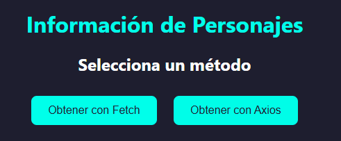

# Rick and Morty API Viewer

Este proyecto muestra cómo consumir la API pública de [Rick and Morty](https://rickandmortyapi.com/) utilizando **Fetch** y **Axios**, dos métodos comunes para realizar solicitudes HTTP en JavaScript.

## 📸 Vista previa

 

## 🚀 Funcionalidades

- Obtener los primeros 10 personajes usando Fetch o Axios.
- Mostrar sus imágenes, nombres y especies.
- Cambiar el subtítulo dinámicamente según el método usado.
- Estilos personalizados con CSS externo.
- Diseño adaptable y con hover interactivo.

## 🛠️ Tecnologías usadas

- HTML5
- CSS3
- JavaScript ES6
- Axios CDN

## 📁 Estructura del proyecto

rick-and-morty-api/
│
├── index.html # Página principal
├── styles.css # Estilos externos
├── main.js # Lógica Fetch y Axios
├── README.md # Este archivo
└── preview.png # (opcional) captura de pantalla
## ▶️ Cómo usarlo

1. Descarga o clona este repositorio.
2. Abre `index.html` directamente en tu navegador (no se requiere servidor).
3. Haz clic en los botones para cargar personajes usando Fetch o Axios.

## 📦 CDN Axios

Axios se carga mediante CDN, así que no necesitas instalar dependencias ni usar npm:

```html
<script src="https://cdn.jsdelivr.net/npm/axios/dist/axios.min.js"></script>
```
## 🧠 Aprende más
Este proyecto es ideal si estás aprendiendo a:
-Trabajar con APIs REST.
-Diferenciar el uso de Fetch vs Axios.
-Manipular el DOM.
-Aplicar estilos CSS modernos.
